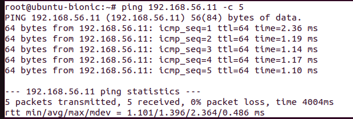

# Multi host docker-container networking using VxLAN tunnel at GCP

## Objective:

<figure >

  
  
Overall Dataflow Diagram

</figure>

Multi-host Docker networking using VXLAN tunnel is a networking technique that allows multiple Docker containers to communicate with each other across multiple hosts. It uses the Virtual Extensible LAN (VXLAN) protocol to create an overlay network that spans multiple hosts.

In this tutorial, we will drive into VxLAN technology, Docker containers, and the process of creating and establishing communication between them.

We will create two host machine at GCP (Google Cloud Platform) and two container in the two host machine. Then, we will ping from one container in first host machine to another container in second host machine.

## Prerequisites:

Basic familiarity with Linux and networking concepts.
GCP account, Basic knowladge of VPC, Instance, Subnet etc

## Step 1: Setting Up the Environment:

At first, login at your GCP account, then create one VPC (virtual private cloud) with 192.168.0.0/24 subnet. After that, create two instances (VM) named host-1 and host-2 with assigned 192.168.56.10 & 192.168.56.11 then ssh login into two vm. 

<figure >

  

</figure>
 
Two VM intances looks like this diagram - 

<figure >

   

</figure>
 
Now swith to root user. 

    sudo -i

Now, just for testing prupose type this command from Host1 terminal.

    ping 192.168.56.11 -c 5

You will get output like this.

<figure >

   

</figure>

## Step 2: Docker client installing:

For Host 1:

    # update the repository and install docker
    sudo apt update
    sudo apt install -y docker.io

    # create a separate docker bridge network
    sudo docker network create --subnet 172.18.0.0/16 vxlan-net

    # terminal output
    9cf37989bab1eafa3d64b6a84913a306b4b932479c922283a49be4607141078a(you may
    have different id)

    # list all networks in docker
    sudo docker network ls

    # terminal output
    NETWORK ID     NAME        DRIVER    SCOPE
    967ea8c58733   bridge      bridge    local
    b95e91a057b9   host        host      local
    b8ee1f28d89e   none        null      local
    9cf37989bab1   vxlan-net   bridge    local

For Host 2:

    # update the repository and install docker
    sudo apt update
    sudo apt install -y docker.io

    # create a separate docker bridge network
    sudo docker network create --subnet 172.18.0.0/16 vxlan-net

    # terminal output
    6f5786b0f1c048e318de5964232f52a1c7d5c94e51db638851181e7eb8149b31(you may have
    different id)

    # list all networks in docker
    sudo docker network ls

    # terminal output
    NETWORK ID     NAME        DRIVER    SCOPE
    561ce8ecf5ab   bridge      bridge    local
    56e042ab0761   host        host      local
    9f8f72967235   none        null      local
    6f5786b0f1c0   vxlan-net   bridge    local

<figure >

   

</figure>

Now type the command.

For Host 1:

    # Check interfaces
    ip a

    # terminal output
    1: lo: <LOOPBACK,UP,LOWER_UP> mtu 65536 qdisc noqueue state UNKNOWN group default qlen 1000
    link/loopback 00:00:00:00:00:00 brd 00:00:00:00:00:00
    inet 127.0.0.1/8 scope host lo
       valid_lft forever preferred_lft forever
    inet6 ::1/128 scope host 
       valid_lft forever preferred_lft forever
    2: ens4: <BROADCAST,MULTICAST,UP,LOWER_UP> mtu 1500 qdisc fq_codel state UP group default qlen 1000
    link/ether 08:00:27:1f:0c:6e brd ff:ff:ff:ff:ff:ff
    inet 192.168.56.10/24 brd 192.168.56.255 scope global ens4
    valid_lft forever preferred_lft forever
    inet6 fe80::a00:27ff:fe1f:c6e/64 scope link
    valid_lft forever preferred_lft forever
    3: docker0: <NO-CARRIER,BROADCAST,MULTICAST,UP> mtu 1500 qdisc noqueue state DOWN group default
    link/ether 02:42:db:76:71:bd brd ff:ff:ff:ff:ff:ff
    inet 172.17.0.1/16 brd 172.17.255.255 scope global docker0
    valid_lft forever preferred_lft forever
    4: br-9cf37989bab1: <NO-CARRIER,BROADCAST,MULTICAST,UP> mtu 1500 qdisc noqueue state DOWN group default
    link/ether 02:42:9c:21:e3:c8 brd ff:ff:ff:ff:ff:ff
    inet 172.18.0.1/16 brd 172.18.255.255 scope global br-9cf37989bab1
    valid_lft forever preferred_lft forever

For Host 2:

    # Check interfaces
    ip addr

    # terminal output
    1: lo: <LOOPBACK,UP,LOWER_UP> mtu 65536 qdisc noqueue state UNKNOWN group default qlen 1000
    link/loopback 00:00:00:00:00:00 brd 00:00:00:00:00:00
    inet 127.0.0.1/8 scope host lo
       valid_lft forever preferred_lft forever
    inet6 ::1/128 scope host 
       valid_lft forever preferred_lft forever 
    2: ens4: <BROADCAST,MULTICAST,UP,LOWER_UP> mtu 1500 qdisc fq_codel state UP group default qlen 1000
    link/ether 08:00:27:d8:5a:c9 brd ff:ff:ff:ff:ff:ff
    inet 192.168.56.11/24 brd 192.168.56.255 scope global ens4
    valid_lft forever preferred_lft forever
    inet6 fe80::a00:27ff:fed8:5ac9/64 scope link
    valid_lft forever preferred_lft forever
    3: docker0: <NO-CARRIER,BROADCAST,MULTICAST,UP> mtu 1500 qdisc noqueue state DOWN group default
    link/ether 02:42:7d:06:a4:6c brd ff:ff:ff:ff:ff:ff
    inet 172.17.0.1/16 brd 172.17.255.255 scope global docker0
    valid_lft forever preferred_lft forever
    4: br-6f5786b0f1c0: <NO-CARRIER,BROADCAST,MULTICAST,UP> mtu 1500 qdisc noqueue state DOWN group default
    link/ether 02:42:25:c9:9c:2e brd ff:ff:ff:ff:ff:ff
    inet 172.18.0.1/16 brd 172.18.255.255 scope global br-6f5786b0f1c0
    valid_lft forever preferred_lft forever

## Step 3: Run Docker Container:

For Host 1:

    # running ubuntu container with "sleep 7000" and a static ip
    sudo docker run -d --net vxlan-net --ip 172.18.0.11 ubuntu sleep 7000

    # terminal output
    ae758aab33a9a1b0d1249341db2dcd58e8b4a5da68e817c7328d22bd79a8da86

    # check the container running or not
    sudo docker ps

    # terminal output
    CONTAINER ID   IMAGE     COMMAND        CREATED              STATUS              PORTS     NAMES
    ae758aab33a9   ubuntu    "sleep 7000"   About a minute ago   Up About a minute             great_booth

    # check the IPAddress to make sure that the ip assigned properly
    sudo docker inspect ae758aab33a9| grep IPAddress (carefully give the container
    id here)

    # terminal output
            "SecondaryIPAddresses": null,
            "IPAddress": "",
                    "IPAddress": "172.18.0.11",

    # ping the docker bridge ip to see whether the traffic can pass
    ping 172.18.0.1 -c 2

    # terminal output
    PING 172.18.0.1 (172.18.0.1) 56(84) bytes of data.
    64 bytes from 172.18.0.1: icmp_seq=1 ttl=64 time=0.047 ms
    64 bytes from 172.18.0.1: icmp_seq=2 ttl=64 time=0.044 ms
    
    --- 172.18.0.1 ping statistics ---
    2 packets transmitted, 2 received, 0% packet loss, time 1010ms
    rtt min/avg/max/mdev = 0.044/0.045/0.047/0.001 ms

For Host 2:

    # running ubuntu container with "sleep 7000" and a static ip
    sudo docker run -d --net vxlan-net --ip 172.18.0.12 ubuntu sleep 7000

    # terminal output
    8f2eac05f3463cf732867474f31819a405ca971577b8c6d1a3e9a68f987f2abd

    # check the container running or not
    sudo docker ps

    # terminal output
    CONTAINER ID   IMAGE     COMMAND        CREATED          STATUS          PORTS     NAMES
    8f2eac05f346   ubuntu    "sleep 7000"   58 seconds ago   Up 56 seconds             great_buck

    # check the IPAddress to make sure that the ip assigned properly
    sudo docker inspect 8f2eac05f346| grep IPAddress(carefully give the container
    id here)

    # terminal output
            "SecondaryIPAddresses": null,
            "IPAddress": "",
                    "IPAddress": "172.18.0.12",

    # ping the docker bridge ip to see whether the traffic can pass
    ping 172.18.0.1 -c 2

    # terminal output
    PING 172.18.0.1 (172.18.0.1) 56(84) bytes of data.
    64 bytes from 172.18.0.1: icmp_seq=1 ttl=64 time=0.047 ms
    64 bytes from 172.18.0.1: icmp_seq=2 ttl=64 time=0.044 ms

    --- 172.18.0.1 ping statistics ---
    2 packets transmitted, 2 received, 0% packet loss, time 1010ms
    rtt min/avg/max/mdev = 0.044/0.045/0.047/0.001 ms

<figure >

   

</figure>

## Step 4: Access Docker Container:

For Host 1:

    # enter the running container using exec
    sudo docker exec -it ae758aab33a9 bash (carefully give the container id, you
    should have different container id)
    
    # Now we are inside running container
    # update the package and install net-tools and ping tools
    apt-get update
    apt-get install net-tools 
    apt-get install iputils-ping
    
    # Now ping the another container
    ping 172.18.0.12 -c 2
    
    # terminal output
    ping 172.18.0.12 -c 2
    PING 172.18.0.12 (172.18.0.12) 56(84) bytes of data.
    From 172.18.0.11 icmp_seq=1 Destination Host Unreachable
    From 172.18.0.11 icmp_seq=2 Destination Host Unreachable
    
    --- 172.18.0.12 ping statistics ---
    2 packets transmitted, 0 received, +2 errors, 100% packet loss, time 1026ms
    pipe 2

For Host 2:

    # enter the running container using exec
    sudo docker exec -it 8f2eac05f346 bash (carefully give the container id, you
    should have different container id)
    
    # Now we are inside running container
    # update the package and install net-tools and ping tools
    apt-get update
    apt-get install net-tools
    apt-get install iputils-ping
    
    # Now ping the another container
    ping 172.18.0.11 -c 2
    
    # terminal output
    ping 172.18.0.11 -c 2
    PING 172.18.0.11 (172.18.0.11) 56(84) bytes of data.
    From 172.18.0.12 icmp_seq=1 Destination Host Unreachable
    From 172.18.0.12 icmp_seq=2 Destination Host Unreachable
    
    --- 172.18.0.11 ping statistics ---
    2 packets transmitted, 0 received, +2 errors, 100% packet loss, time 1003ms pipe 2

Now type exit to came out from container.

## Step 5: Creating VxLAN Tunnel:

It’s time to create a VxLAN tunnel to establish communication between two hosts running containers. Then attch the vxlan to the docker bridge. Make sure the VNI ID is the same for both hosts.

For Host 1:

    # install bridge network tools
    sudo apt-get install net-tools

    # check the bridges list on the hosts
    sudo brctl show
    
    # terminal output
    bridge name	bridge id		STP enabled	interfaces
    br-9cf37989bab1		8000.02429c21e3c8	no		veth184b817
    docker0		8000.0242db7671bd	no
    
    # create a vxlan
    # 'vxlan-demo' is the name of the interface, type should be vxlan
    # VNI ID is 100
    # dstport should be 4789 which a udp standard port for vxlan communication
    # 192.168.56.11 is the ip of another host
    sudo ip link add vxlan-demo type vxlan id 100 remote 192.168.56.11 dstport 4789 dev ens4
    
    # check interface list if the vxlan interface created
    ip a | grep vxlan
    
    # terminal output
    8: vxlan-demo: <BROADCAST,MULTICAST> mtu 1450 qdisc noop state DOWN group default qlen 1000
    
    # make the interface up
    sudo ip link set vxlan-demo up
    
    # now attach the newly created vxlan interface to the docker bridge we created
    sudo brctl addif br-9cf37989bab1 vxlan-demo (carefully give the bridge id)
    
    # check the route to ensure everything is okay. here '172.18.0.0' part is our concern part.
    sudo route -n
    
    #terminal output
    Kernel IP routing table
    Destination     Gateway         Genmask         Flags Metric Ref    Use Iface
    0.0.0.0         192.168.56.1    0.0.0.0         UG    100    0        0 ens4
    172.17.0.0      0.0.0.0         255.255.0.0     U     0      0        0 docker0
    172.18.0.0      0.0.0.0         255.255.0.0     U     0      0        0 br-9cf37989bab1
    192.168.56.1    0.0.0.0         255.255.255.0   U     0      0        0 ens4

For Host 2:

    # install bridge network tools
    sudo apt-get install net-tools

    # check the bridges list on the hosts
    sudo brctl show
    
    #terminal output
    bridge name	bridge id		STP enabled	interfaces
    br-6f5786b0f1c0		8000.024225c99c2e	no		veth8d643b1
    docker0		8000.02427d06a46c	no
    
    # 192.168.56.10 is the ip of another host
    # make sure VNI ID is the same on both hosts, this is important
    sudo ip link add vxlan-demo type vxlan id 100 remote 192.168.56.10 dstport 4789 dev ens4
    
    # check interface list if the vxlan interface created
    ip a | grep vxlan
    
    # terminal output
    8: vxlan-demo: <BROADCAST,MULTICAST> mtu 1450 qdisc noop state DOWN group default qlen 1000
    
    # make the interface up
    sudo ip link set vxlan-demo up

    # now attach the newly created vxlan interface to the docker bridge we created
    sudo brctl addif br-6f5786b0f1c0 vxlan-demo (carefully give the bridge id)
    
    # check the route to ensure everything is okay. here '172.18.0.0' part is our concern part.
    sudo route -n
    
    # terminal output
    Kernel IP routing table
    Destination     Gateway         Genmask         Flags Metric Ref    Use Iface
    0.0.0.0         192.168.56.1    0.0.0.0         UG    100    0        0 ens4
    172.17.0.0      0.0.0.0         255.255.0.0     U     0      0        0 docker0
    172.18.0.0      0.0.0.0         255.255.0.0     U     0      0        0 br-6f5786b0f1c0
    192.168.56.1    0.0.0.0         255.255.255.0   U     0      0        0 ens4

## Step 6: Testing the connectivity:
Now test the connectivity. It should work now. A Vxlan Overlay Network Tunnel has been created.

For Host 1:

    # enter the running container using exec
    sudo docker exec -it ae758aab33a9 bash (carefully give the container id, you
    should have different container id)
    
    # ping the other (host-2) container IP
    ping 172.18.0.12 -c 2
    
    # terminal output
    PING 172.18.0.12 (172.18.0.12) 56(84) bytes of data.
    64 bytes from 172.18.0.12: icmp_seq=1 ttl=64 time=1.64 ms
    64 bytes from 172.18.0.12: icmp_seq=2 ttl=64 time=1.60 ms
    
    --- 172.18.0.12 ping statistics ---
    2 packets transmitted, 2 received, 0% packet loss, time 1001ms
    rtt min/avg/max/mdev = 1.602/1.620/1.639/0.018 ms

For Host 2:

    # enter the running container using exec
    sudo docker exec -it 8f2eac05f346 bash
    
    # ping the other (host-1) container IP
    ping 172.18.0.11 -c 2
    
    # terminal output
    PING 172.18.0.11 (172.18.0.11) 56(84) bytes of data.
    64 bytes from 172.18.0.11: icmp_seq=1 ttl=64 time=1.55 ms
    64 bytes from 172.18.0.11: icmp_seq=2 ttl=64 time=1.61 ms
    
    --- 172.18.0.11 ping statistics ---
    2 packets transmitted, 2 received, 0% packet loss, time 1002ms
    rtt min/avg/max/mdev = 1.551/1.579/1.607/0.028 ms

And finally we have successfully ping from one container in one host to another container from second host.

<figure >

  
  
Overall Dataflow Diagram

</figure>

